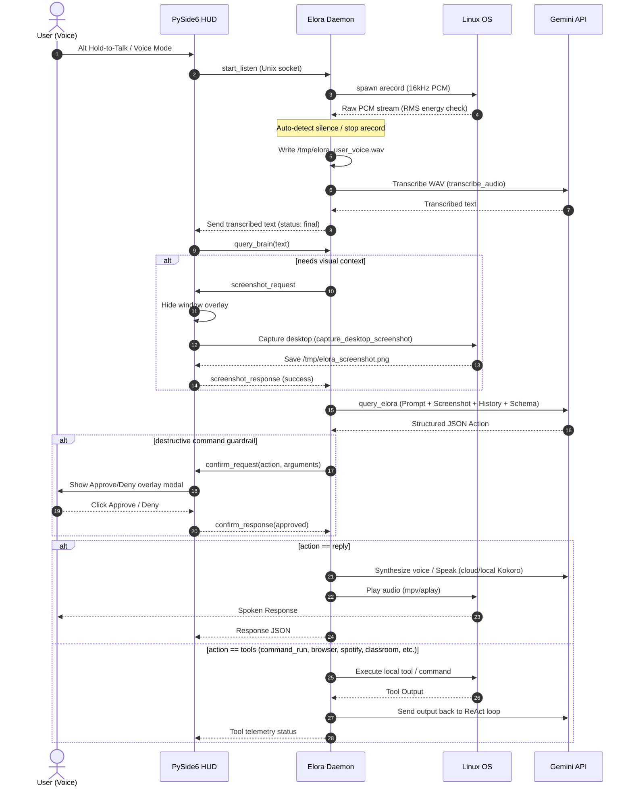

# Elora: Linux Desktop OS Orchestrator

Elora is a lightweight, low-resource command-line loop and desktop assistant. It leverages the native multimodal capabilities of the **Gemini API** (`gemini-2.5-flash`, with fallbacks to `gemini-3.5-flash`, `gemini-2.0-flash`) to capture voice commands and screenshots, determining and executing desktop automation actions instantly using Linux utilities without freezing your terminal.

By offloading all Speech-to-Text (STT), Text-to-Speech (TTS), visual parsing, and reasoning to Gemini's TPU cloud architecture (or offline local runners for TTS), Elora runs in a negligible memory footprint (<50MB RAM), making it highly optimized for resource-constrained systems (e.g. 4GB RAM).

---

## 📐 Architecture Diagram

Elora utilizes a client-daemon architecture to decouple the PySide6 Graphical User Interface (HUD) from the Gemini ReAct execution loop. The front-end communicates with the background daemon over a local Unix socket (`/tmp/elora.sock`).



---

## Features

*   **Low-Resource Architecture**: Zero local machine learning models loaded for inference by default. Offloads heavy intelligence, transcription, and speech rendering onto Gemini's TPUs.
*   **IPC Daemon Decoupling**: Background daemon manages execution state, schedules classroom notifications, and preloads models in background threads, making application and HUD start instant.
*   **Real-time Desktop Vision**: Automatically captures the active desktop or window (supporting Wayland/GNOME via DBus, Wayland/Niri via `grim`, and X11 via PyAutoGUI) to give Gemini direct visual context. HUD automatically hides itself before capturing to ensure a clean desktop view.
*   **Background Agent Delegation & Monitoring**: Automatically delegates complex coding or research tasks to the Antigravity CLI (`agy`) inside a detached background `tmux` session, releasing your terminal instantly. View real-time log outputs, track running times, and cancel active sessions directly from the HUD dashboard.
*   **Fuzzy Spotify & Music Control**: Integrates `spotify-cli` and `playerctl` locally to command playback sessions. Supports library-first searches (Liked Songs and playlists) and self-healing active device detection.
*   **Google Classroom & Calendar Integration**: Fetches assignments, downloads worksheets, alerts upcoming deadlines (<24h), and syncs coursework deliverables directly to Google Calendar.
*   **Semantic Memory Engine**: Persistent database storing personal preferences, server settings, and configurations. Supports recall, topic filtering, targeted focus blocks, and forgetting.
*   **RSS News Aggregator (Skim & Deep Dive)**: Fetches and parses popular tech feeds locally. Prints summaries directly in Markdown and launches articles on-demand in the default system browser via `xdg-open`.
*   **System Notifications**: Uses `notify-send` and auditory chimes (`aplay`/`mpv`) to send non-blocking task alerts.
*   **Safe Gate Guardrails**: Automatically detects and halts potentially destructive commands (e.g., matching keywords like `rm`, `dd`, `sudo`, or system path redirections) and prompts the user for explicit confirmation (Approve/Deny) before execution while letting safe commands run freely.
*   **Intelligent Non-Interactive Execution**: Automatically rewrites common interactive shell commands (e.g., `npx create-next-app`, `npm init`, `yarn init`) to inject non-interactive flags (e.g., `-y`, `--yes`) and modern defaults, preventing subprocesses from hanging on standard input prompts.

---

## Getting Started

### Prerequisites

Ensure the following tools are installed on your Linux system:
*   [uv](https://github.com/astral-sh/uv) (Python package manager)
*   `tmux` (terminal multiplexer)
*   `notify-send` (libnotify)
*   `aplay` / `mpv` (sound players)

### Installation

You can install Elora to standard user paths (`~/.local/share/elora`, `~/.local/bin/elora`), register the desktop application entry, and configure the background systemd daemon service by running the installer:

```bash
chmod +x install.sh
./install.sh
```

### Guided Configuration Wizard

At the end of the installation, or at any time by running:
```bash
elora --setup
# or manually in development:
uv run python main.py --setup
```
an interactive setup wizard will guide you through:
1. **Google Gemini API Key**: Links your Google AI Studio API key (obtain a free key from [Google AI Studio](https://aistudio.google.com/)).
2. **Speech & Voice Feedback**: Selects between a local offline speech engine (Kokoro-ONNX) or cloud engine (waking up a custom Hugging Face Space).
3. **Spotify Music Control**: Detects, installs, and logs you into `spotify-cli` (`spotify-cli auth login` is run directly from the wizard).
4. **Google Classroom Integration**: Sets up the Google Cloud credentials JSON file path for listing pending coursework.

---

## Usage

Elora can be executed in seven modes:

### 1. Interactive REPL Mode
Start an interactive conversational loop:
```bash
elora
# or in development:
uv run python main.py
```

### 2. Direct Query Mode
Send a single query directly from the shell:
```bash
uv run python main.py "Fetch tech news"
```

### 3. Piped Input Mode
Pipe commands directly into Elora:
```bash
echo "Open the article for number 3" | uv run python main.py
```

### 4. Hands-Free Voice Mode
Start a hands-free voice loop that listens to your speech, auto-detects when you finish speaking using lightweight RMS energy thresholding, and responds out loud:
```bash
uv run python main.py --voice
```

### 5. Centralized HUD Dashboard Mode
Launch a gorgeous, transparent, maximized graphical overlay featuring a modular Left-Center-Right dashboard. The system monitor progress bars occupy the left panel, the animated voice orb and interactive Cava audio visualizer float in the center, and a vertical command deck with a collapsible tab drawer (Chat, Tools, Settings, Tasks, News, Browser) handles navigation on the right. Hold down the `Alt` key to speak, release it to execute, and press `Esc` to collapse an open sidebar drawer or exit:
```bash
uv run python main.py --hud
```

#### **Instant Voice Launch (Hands-Free)**
Pass the `--voice` (or `-v`) flag to launch the HUD directly in **listening mode**, bypassing the startup greeting:
```bash
uv run python main.py --hud --voice
```
This is ideal for binding to a system-wide hotkey (e.g., `Super+Space` or `Alt+Space` mapped to `elora --hud --voice`). When pressed, the HUD opens instantly and immediately captures your spoken command. The daemon's silence-detection automatically stops the recording and runs your request when you finish speaking.

### 6. Screen Explanation Mode
Take a screenshot of your active desktop workspace and generate a conversational explanation of what is currently on the screen using Gemini's visual capabilities:
```bash
uv run python main.py --explain-screen
```

### 7. Interactive Configuration Wizard Mode
Configure API keys, Voice/Speech provider, Spotify CLI authentication, and Google Classroom credentials:
```bash
elora --setup
```

---

## Configuration

Elora settings are stored dynamically in `~/.config/elora/config.json`. You can modify them directly inside the HUD Settings panel—where options are cleanly organized into **Speech**, **Brain**, and **System** sub-tabs to minimize clutter—or manually customize the file:

```json
{
  "model_name": "gemini-2.5-flash",
  "gemini_api_key": "YOUR_GEMINI_API_KEY",
  "news": {
    "feeds": [
      "https://news.ycombinator.com/rss",
      "https://www.phoronix.com/rss.php",
      "https://techcrunch.com/feed/",
      "https://news.google.com/rss"
    ],
    "limit_per_feed": 3,
    "custom_blogs": []
  },
  "sound": {
    "enabled": true
  },
  "voice": {
    "enabled": true,
    "provider": "cloud",
    "hf_space_url": "https://username-space.hf.space",
    "hf_token": "YOUR_HF_TOKEN",
    "voice_name": "af_heart",
    "speed": 1.0,
    "quantized": true
  },
  "browser": {
    "default_command": "xdg-open"
  },
  "email": {
    "enabled": false,
    "imap_server": "imap.gmail.com",
    "imap_port": 993,
    "email_address": "user@gmail.com",
    "password_env_var": "ELORA_EMAIL_PASSWORD",
    "max_emails_to_check": 10
  },
  "personality": "default",
  "custom_personality": ""
}
```

*   **model_name**: Primary Gemini API model (`gemini-2.5-flash`, `gemini-3.5-flash`, etc.).
*   **gemini_api_key**: Your Google AI Studio API key.
*   **news.feeds**: List of tech feed RSS URLs.
*   **news.custom_blogs**: Selector mappings for non-RSS sites via Playwright.
*   **sound.enabled**: Enable system notifications auditory chimes.
*   **voice.enabled**: Toggles voice feedback.
*   **voice.provider**: Set to `cloud` to use a cloud-hosted Hugging Face Space for Kokoro speech synthesis, or `local` to run it offline.
*   **voice.hf_space_url**: The endpoint URL of your Hugging Face space.
*   **voice.hf_token**: (Optional) Hugging Face user access token.
*   **voice.voice_name**: Sets the active speech voice (e.g. `af_heart` for Kokoro).
*   **voice.speed**: The playback speed multiplier.
*   **email.enabled**: Toggles the IMAP email reporting feature.
*   **email.imap_server**: The hostname of your IMAP server (e.g., `imap.gmail.com`).
*   **email.imap_port**: The SSL/TLS port of your IMAP server (typically `993`).
*   **email.email_address**: The email address used to authenticate.
*   **email.password_env_var**: The environment variable name where your IMAP account/app password is stored (default is `ELORA_EMAIL_PASSWORD`).
*   **email.max_emails_to_check**: The number of recent/unread emails to scan and summarize.
*   **personality**: Target assistant response persona (`default`, `funny`, `direct`, `polite`, `respectful`, `other`).
*   **custom_personality**: Dynamic style instructions used when personality is set to `other`.

### Hugging Face Space Warmup
Free Hugging Face Spaces on default tiers automatically suspend after 48 hours of inactivity. To prevent the cold-start delay from affecting your first speech request, the Elora daemon automatically initiates an asynchronous warmup routine for your Space in the background when the daemon boots or receives a preload request.

### Google Classroom Integration Setup
Elora includes an autonomous Google Classroom assignment helper capable of fetching active assignments, tracking upcoming due dates, and downloading Google Drive worksheets/attachments to summarize tasks.

To configure this skill:
1. Create a Desktop Application OAuth credential inside the [Google Cloud Console](https://console.cloud.google.com/) with Classroom & Drive read-only scopes.
2. Download the JSON credentials file and save it exactly as `~/.config/elora/classroom_credentials.json`.
3. The first time Elora runs a classroom command (e.g. `"What homework is due soon?"`), a browser window will automatically launch for authentication. Once authorized, Elora will save the refresh token to `~/.config/elora/classroom_token.json` for continuous background access.

---

## Project Structure

*   [main.py](file:///home/usoy/Documents/antigravity/elora/main.py) — Core CLI listener, command route manager, and GUI/HUD/daemon launcher.
*   **`elora/`** (Package):
    *   **`core/`**:
        *   [brain.py](file:///home/usoy/Documents/antigravity/elora/elora/core/brain.py) — Connects to Gemini API, manages prompts, and enforces JSON action schemas.
        *   [agent.py](file:///home/usoy/Documents/antigravity/elora/elora/core/agent.py) — Manages the multi-turn ReAct reasoning loop and tool execution.
        *   [config.py](file:///home/usoy/Documents/antigravity/elora/elora/core/config.py) — Dynamic user configuration and session history manager.
        *   [memory.py](file:///home/usoy/Documents/antigravity/elora/elora/core/memory.py) — Semantic memory store and recall context manager.
    *   **`ipc/`**:
        *   [daemon.py](file:///home/usoy/Documents/antigravity/elora/elora/ipc/daemon.py) — Persistent UNIX socket server handling energy-based STT silence detection and classroom polling schedules.
        *   [daemon_client.py](file:///home/usoy/Documents/antigravity/elora/elora/ipc/daemon_client.py) — Socket communication wrapper syncing terminal graphical environment variables.
    *   **`ui/`**:
        *   [hud_window.py](file:///home/usoy/Documents/antigravity/elora/elora/ui/hud_window.py) — Main PySide6 dashboard window managing Left-Center-Right layout widget decks.
        *   [hud_overlay.py](file:///home/usoy/Documents/antigravity/elora/elora/ui/hud_overlay.py) — Transparent blocker overlay managing safe gate action verification modals.
        *   [voice_orb.py](file:///home/usoy/Documents/antigravity/elora/elora/ui/voice_orb.py) — Animated custom-drawn orb displaying conversational states.
        *   [cava_visualizer.py](file:///home/usoy/Documents/antigravity/elora/elora/ui/cava_visualizer.py) — Graphical bar visualization parsing cava loopback stdout stream.
        *   [system_monitor.py](file:///home/usoy/Documents/antigravity/elora/elora/ui/system_monitor.py) — System resource sensors and statistics cards.
        *   [threads.py](file:///home/usoy/Documents/antigravity/elora/elora/ui/threads.py) — QThread encapsulation for running socket requests asynchronously off the main GUI thread.
        *   [styles.py](file:///home/usoy/Documents/antigravity/elora/elora/ui/styles.py) — QSS obsidian stylesheet definitions.
    *   **`skills/`**:
        *   [actions.py](file:///home/usoy/Documents/antigravity/elora/elora/skills/actions.py) — Spawns background agent tasks in tmux sessions and monitors their execution.
        *   [browser_control.py](file:///home/usoy/Documents/antigravity/elora/elora/skills/browser_control.py) — Remote CDP controller for driving Brave browser actions.
        *   [classroom.py](file:///home/usoy/Documents/antigravity/elora/elora/skills/classroom.py) — Google Classroom coursework, submissions, and Google Drive attachment parsing.
        *   [email.py](file:///home/usoy/Documents/antigravity/elora/elora/skills/email.py) — Local IMAP email fetcher and reporting engine.
        *   [news.py](file:///home/usoy/Documents/antigravity/elora/elora/skills/news.py) — Technical feeds RSS/Playwright parser and formatting tool.
        *   [os_control.py](file:///home/usoy/Documents/antigravity/elora/elora/skills/os_control.py) — Universal mouse cursor, keyboard type, and screenshot capture simulation.
        *   [skills.py](file:///home/usoy/Documents/antigravity/elora/elora/skills/skills.py) — DuckDuckGo search and BeautifulSoup web scraping helper.
        *   [spotify.py](file:///home/usoy/Documents/antigravity/elora/elora/skills/spotify.py) — Fuzzy music search and play integration via spotify-cli and playerctl.
        *   [stt.py](file:///home/usoy/Documents/antigravity/elora/elora/skills/stt.py) — Backup local RMS silence threshold recorder.
        *   [system_skills.py](file:///home/usoy/Documents/antigravity/elora/elora/skills/system_skills.py) — OS audio controls, brightness, and application launch helpers.
        *   [voice.py](file:///home/usoy/Documents/antigravity/elora/elora/skills/voice.py) — TTS voice synthesis routing and Hugging Face warmup engine.
    *   [hud.py](file:///home/usoy/Documents/antigravity/elora/elora/hud.py) — Facade router maintaining start_hud imports backward-compatibility.
    *   [utils.py](file:///home/usoy/Documents/antigravity/elora/elora/utils.py) — Desktop notify-send alerts and sound playing utilities.

