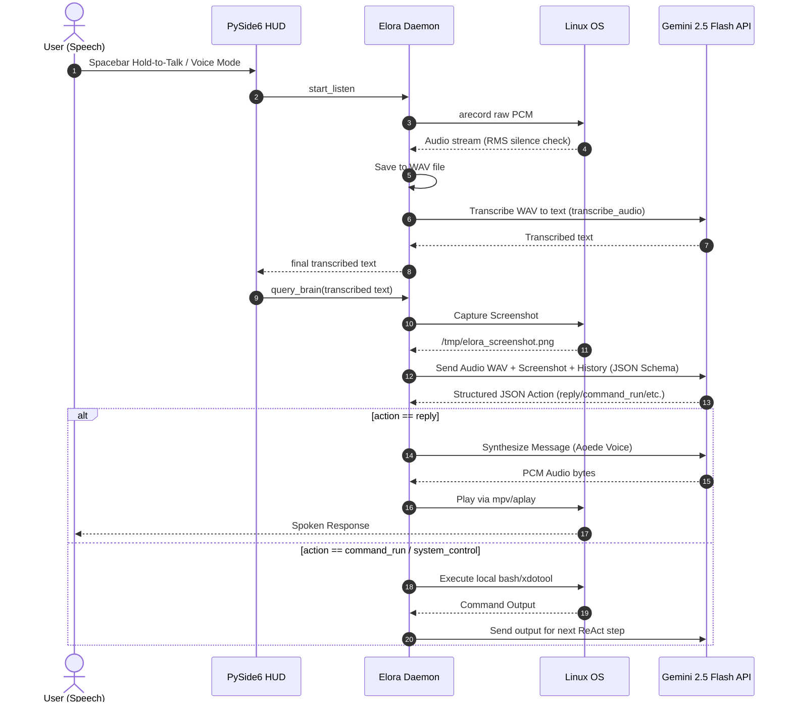

# Elora: Linux Desktop OS Orchestrator

Elora is a lightweight, low-resource command-line loop and desktop assistant. It leverages the native multimodal capabilities of the **Gemini API** (`gemini-2.5-flash`) to capture voice commands and screenshots, determining and executing desktop automation actions instantly using Linux utilities without freezing your terminal.

By offloading all Speech-to-Text (STT), Text-to-Speech (TTS), visual parsing, and reasoning to Gemini's TPU cloud architecture, Elora runs in a negligible memory footprint (<50MB RAM), making it highly optimized for resource-constrained systems (e.g. 4GB RAM).

---

## 📐 Architecture Diagram



---

## Features

*   **Low-Resource Architecture**: Zero local machine learning models loaded. Offloads heavy intelligence, transcription, and speech rendering onto Gemini's TPUs.
*   **Real-time Desktop Vision**: Automatically captures the active desktop or window (supporting both Wayland/GNOME via DBus, Wayland/Niri via `grim`, and X11 via PyAutoGUI) to give Gemini direct visual context.
*   **Background Agent Delegation & Monitoring**: Automatically delegates complex coding or research tasks to the Antigravity CLI (`agy`) inside a detached background `tmux` session, releasing your terminal instantly. View real-time log outputs, track running times, and cancel active sessions directly from the HUD dashboard.
*   **RSS News Aggregator (Skim & Deep Dive)**: Fetches and parses popular tech feeds locally. Prints summaries directly in Markdown and launches articles on-demand in the default system browser via `xdg-open`.
*   **System Notifications**: Uses `notify-send` and auditory chimes (`aplay`/`mpv`) to send non-blocking task alerts.
*   **Action Telemetry & Thought Tracing**: Exposes the AI agent's reasoning process (`thought` blocks) and comprehensive tool start and outcome logs (collapsible details panel in HUD and formatted telemetry blocks in CLI).
*   **Safe Gate Guardrails**: Automatically detects and halts potentially destructive commands (e.g., matching keywords like `rm`, `dd`, `sudo`, or system path redirections) and prompts the user for explicit confirmation (Approve/Deny) before execution while letting safe commands run freely.
*   **Intelligent Non-Interactive Execution**: Automatically rewrites common interactive shell commands (e.g., `npx create-next-app`, `npm init`, `yarn init`) to inject non-interactive flags (e.g., `-y`, `--yes`) and modern defaults, preventing subprocesses from hanging on standard input prompts.


---

## Getting Started

### Prerequisites

Ensure the following tools are installed on your Linux system:
*   [uv](https://github.com/astral-sh/uv) (Python package manager)
*   `tmux` (terminal multiplexer)
*   `notify-send` (libnotify)
*   `aplay` / `mpv` (sound players)

### Setup & Authentication

1.  Sync dependencies using `uv`:
    ```bash
    uv sync
    ```
2.  Obtain a free Gemini API Key from Google AI Studio and configure it:
    *   Set the `GEMINI_API_KEY` environment variable, OR
    *   Paste it directly inside the HUD Settings panel.

---

## Usage

Elora can be executed in five modes:

### 1. Interactive REPL Mode
Start an interactive conversational loop:
```bash
uv run python main.py
```

### 2. Direct Query Mode
Send a single query directly from the shell:
```bash
uv run python main.py "Fetch tech news"
```

### 3. Piped Input Mode
Pipe commands directly into Elora:
```bash
echo "Open the article for number 3" | uv run python main.py
```

### 4. Hands-Free Voice Mode
Start a hands-free voice loop that listens to your speech, auto-detects when you finish speaking using lightweight RMS energy thresholding, and responds out loud:
```bash
uv run python main.py --voice
```

### 5. Centralized HUD Dashboard Mode
Launch a gorgeous, transparent, maximized graphical overlay featuring a modular Left-Center-Right dashboard. The system monitor progress bars occupy the left panel, the animated voice orb and interactive Cava audio visualizer float in the center, and a vertical command deck with a collapsible tab drawer (Chat, Tools, Settings, Tasks, News, Browser) handles navigation on the right. Hold down the `Alt` key to speak, release it to execute, and press `Esc` to collapse an open sidebar drawer or exit:
```bash
uv run python main.py --hud
```

### 6. Screen Explanation Mode
Take a screenshot of your active desktop workspace and generate a conversational explanation of what is currently on the screen using Gemini's visual capabilities:
```bash
uv run python main.py --explain-screen
```

---

## Configuration

Elora settings are stored dynamically in `~/.config/elora/config.json`. You can modify them directly inside the HUD Settings panel—where options are cleanly organized into **Speech**, **Brain**, and **System** sub-tabs to minimize clutter—or manually customize the file:

```json
{
  "model_name": "gemini-2.5-flash",
  "gemini_api_key": "YOUR_GEMINI_API_KEY",
  "voice": {
    "enabled": true,
    "provider": "cloud",
    "hf_space_url": "https://username-space.hf.space",
    "hf_token": "YOUR_HF_TOKEN",
    "voice_name": "af_heart",
    "speed": 1.0
  },
  "stt": {
    "model_name": "gemini"
  },
  "email": {
    "enabled": false,
    "imap_server": "imap.gmail.com",
    "imap_port": 993,
    "email_address": "user@gmail.com",
    "password_env_var": "ELORA_EMAIL_PASSWORD",
    "max_emails_to_check": 10
  }
}
```

*   **gemini_api_key**: Your personal Google AI Studio API key.
*   **voice.enabled**: Toggles voice feedback.
*   **voice.provider**: Set to `cloud` to use a cloud-hosted Hugging Face Space for Kokoro speech synthesis, or `local` to run it offline.
*   **voice.hf_space_url**: The endpoint URL of your Hugging Face space.
*   **voice.hf_token**: (Optional) Hugging Face user access token.
*   **voice.voice_name**: Sets the active speech voice (e.g. `af_heart` for Kokoro).
*   **voice.speed**: The playback speed multiplier.
*   **stt.model_name**: Set to `gemini` for cloud speech-to-text.
*   **email.enabled**: Toggles the IMAP email reporting feature.
*   **email.imap_server**: The hostname of your IMAP server (e.g., `imap.gmail.com`).
*   **email.imap_port**: The SSL/TLS port of your IMAP server (typically `993`).
*   **email.email_address**: The email address used to authenticate.
*   **email.password_env_var**: The environment variable name where your IMAP account/app password is stored (default is `ELORA_EMAIL_PASSWORD`).
*   **email.max_emails_to_check**: The number of recent/unread emails to scan and summarize.

### Hugging Face Space Warmup
Free Hugging Face Spaces on default tiers automatically suspend after 48 hours of inactivity. To prevent the cold-start delay from affecting your first speech request, the Elora daemon automatically initiates an asynchronous warmup routine for your Space in the background when the daemon boots or receives a preload request.

### Google Classroom Integration Setup
Elora includes an autonomous Google Classroom assignment helper capable of fetching active assignments, tracking upcoming due dates, and downloading Google Drive worksheets/attachments to summarize tasks.

To configure this skill:
1. Create a Desktop Application OAuth credential inside the [Google Cloud Console](https://console.cloud.google.com/) with Classroom & Drive read-only scopes.
2. Download the JSON credentials file and save it exactly as `~/.config/elora/classroom_credentials.json`.
3. The first time Elora runs a classroom command (e.g. `"What homework is due soon?"`), a browser window will automatically launch for authentication. Once authorized, Elora will save the refresh token to `~/.config/elora/classroom_token.json` for continuous background access.

---

## Project Structure

*   [main.py](file:///home/usoy/Documents/antigravity/elora/main.py) — Core CLI listener and loop router.
*   **`elora/`** (Package):
    *   **`core/`**:
        *   [brain.py](file:///home/usoy/Documents/antigravity/elora/elora/core/brain.py) — Connects to Gemini API, handles prompts, and enforces JSON action schemas.
        *   [agent.py](file:///home/usoy/Documents/antigravity/elora/elora/core/agent.py) — Manages the multi-turn ReAct reasoning loop and tool execution.
        *   [config.py](file:///home/usoy/Documents/antigravity/elora/elora/core/config.py) — Dynamic user configuration manager.
        *   [memory.py](file:///home/usoy/Documents/antigravity/elora/elora/core/memory.py) — Semantic memory store and recall context manager.
    *   **`skills/`**:
        *   [classroom.py](file:///home/usoy/Documents/antigravity/elora/elora/skills/classroom.py) — Google Classroom coursework, submissions, and Google Drive attachment parsing.
        *   [email.py](file:///home/usoy/Documents/antigravity/elora/elora/skills/email.py) — Local IMAP email fetcher and reporting engine.
        *   [skills.py](file:///home/usoy/Documents/antigravity/elora/elora/skills/skills.py) — DuckDuckGo search and BeautifulSoup web scraping helper.
        *   [browser_control.py](file:///home/usoy/Documents/antigravity/elora/elora/skills/browser_control.py) — Remote CDP control of Brave browser instances.
        *   [os_control.py](file:///home/usoy/Documents/antigravity/elora/elora/skills/os_control.py) — universal mouse cursor and keyboard shortcuts simulation.
        *   [system_skills.py](file:///home/usoy/Documents/antigravity/elora/elora/skills/system_skills.py) — OS audio controls, brightness, and application launch helpers.
        *   [voice.py](file:///home/usoy/Documents/antigravity/elora/elora/skills/voice.py) — TTS voice synthesis routing (Kokoro speech).
        *   [stt.py](file:///home/usoy/Documents/antigravity/elora/elora/skills/stt.py) — RMS audio threshold listening and STT WAV recording.
    *   [utils.py](file:///home/usoy/Documents/antigravity/elora/elora/utils.py) — Desktop notifications and chime playbacks.
    *   [hud.py](file:///home/usoy/Documents/antigravity/elora/elora/hud.py) — PySide6 desktop transparent HUD dashboard and setting tab manager.
