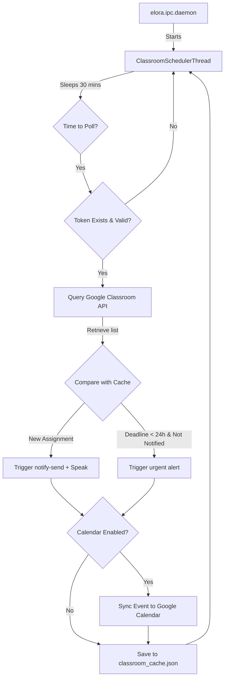

# 📋 Elora Google Classroom Improvements Plan

This document outlines the architectural plan for expanding Elora's Google Classroom capability. The improvements focus on two core features requested by the user:
1. **Background Classroom Scheduler & Notifier**: Keeping the user updated on close deadlines and new assignments.
2. **Draft Response & Study Guide Generator**: Analyzing assignment materials and exporting generated drafts/guides to `.txt`, `.md`, or `.pdf`.

---

## 🛠️ Feature 1: Background Classroom Scheduler & Notifier

### 1. What is Best & Possible
* **Polling Architecture**: Because Elora runs locally as a desktop companion without a public HTTPS endpoint, real-time push webhooks (WebSub) from Google Classroom are not feasible. The best and most robust solution is a **daemon-based background poller** that queries the Classroom API at regular intervals.
* **Unix Socket Daemon Integration**: Elora already runs a persistent background process [elora/ipc/daemon.py](file:///home/usoy/Documents/antigravity/elora/elora/ipc/daemon.py) using Unix sockets. We can spawn a background thread (`ClassroomSchedulerThread`) when the daemon starts in [run_daemon()](file:///home/usoy/Documents/antigravity/elora/elora/ipc/daemon.py#L535).
* **Caching & State Management**: To prevent duplicate alerts, Elora will maintain a local JSON cache at `~/.config/elora/classroom_cache.json`.
* **Multi-Channel Desktop Alerts**:
  * **Desktop Popups**: Native Linux notifications using `notify-send` via Elora's existing [send_notification](file:///home/usoy/Documents/antigravity/elora/elora/utils.py#L15-L33) utility.
  * **Audio Chimes**: Play alert chimes using `aplay`/`mpv` via [play_chime](file:///home/usoy/Documents/antigravity/elora/elora/utils.py#L35-L75).
  * **Speech Synthesis (Local Kokoro Offline)**: If voice mode is enabled, verbally announce new assignments or urgent deadlines using `kokoro-onnx` via `speak_text()`. See details on offline/cold starts below.
  * **Google Calendar Integration (Optional extension)**: Syncing assignments to a primary personal Google Calendar. See details below.

### 2. Google Calendar Integration Considerations
* **Offline Access on Phone**: Google Calendar events are synchronized and cached locally on mobile devices. Once Elora syncs a deadline to your calendar, you can view it on your phone even without internet access.
* **Setup Requirements**: Integrating Google Calendar requires adding the calendar write scope `https://www.googleapis.com/auth/calendar.events` to `SCOPES` in [classroom.py](file:///home/usoy/Documents/antigravity/elora/elora/skills/classroom.py#L24-L29). This will trigger a **one-time re-authentication** browser flow to authorize the new permission. No additional API keys or console setups are needed as we reuse the existing OAuth Desktop credential profile.
* **Rate Limits**: There is virtually no risk of hitting API rate limits. Google Calendar allows 1,000,000 requests per day per project. Elora's polling frequency (every 30 minutes) generates approximately 48 queries a day, which is negligible.

### 3. Voice Engine (Kokoro) & Offline Behavior
* **Local Offline Engine**: Local `kokoro-onnx` executes entirely offline on your CPU once model weights (`kokoro-v1.0.int8.onnx`) and voice binaries (`voices-v1.0.bin`) are downloaded.
* **No Internet at Daemon Startup**:
  * **If assets are already present**: The voice system initializes and runs 100% offline. Voice alerts will work perfectly.
  * **If assets are missing and there is no internet**: The download check in `voice.py` will catch the network error gracefully, log a warning, and start the daemon normally without crashing. Verbal feedback will be disabled until internet is restored and assets can be downloaded.
  * **Cloud Fallback**: If voice mode is configured to use the Hugging Face Space cloud TTS, it will automatically fallback to the local offline client when no internet connection is detected.

### 4. Detailed Technical Design


* **Silent Authentication Handling**: The background poller must not pop up OAuth browser windows if credentials expire. It should verify `os.path.exists(TOKEN_PATH)` and check credentials validity. If expired and a refresh token exists, it should refresh silently. If invalid or missing, it will log a warning and stand down until the user initiates an interactive session.

---

## 📝 Feature 2: Draft Response & Guide Generator

### 1. What is Best & Possible
* **Context Ingestion**: Leverage the existing [fetch_classroom_data](file:///home/usoy/Documents/antigravity/elora/elora/skills/classroom.py#L114) in `analyze_materials` mode to extract coursework details, instructions, and plain-text contents of Google Docs/text attachments.
* **Gemini Analysis & Formatting**: Since Gemini excels at synthesis, Elora will use the LLM to generate:
  * **Study Guides**: Synthesized notes, core questions, and references.
  * **Draft Responses**: Templates for short-answer submissions or writing outlines.
* **Multi-Format Document Exporting**:
  * **Markdown (`.md`)**: Native text generation with headings, bullet points, and code blocks.
  * **Plain Text (`.txt`)**: Basic fallback.
  * **PDF (`.pdf`)**: Using Python's `reportlab` library (which can flow text into clean layouts). This requires adding `reportlab` to [pyproject.toml](file:///home/usoy/Documents/antigravity/elora/pyproject.toml) dependencies.

### 2. Core Action Schema Integration
We will introduce a new action in `ELORA_RESPONSE_SCHEMA` in [elora/core/brain.py](file:///home/usoy/Documents/antigravity/elora/elora/core/brain.py#L136-L172):
* **Action name**: `classroom_export_doc`
* **Arguments**:
  * `content` (string): The generated markdown/text.
  * `filename` (string): The target output name.
  * `format` (string): `"txt"`, `"md"`, or `"pdf"`.

### 3. PDF Generator Helper (`elora/skills/classroom.py`)
To handle PDF conversion, we will write a clean Python helper utilizing `reportlab`. If `reportlab` is not installed, it will fall back to exporting as an `.md` file and advise the user.
```python
def export_to_pdf(markdown_content: str, output_path: str) -> bool:
    try:
        from reportlab.lib.pagesizes import letter
        from reportlab.platypus import SimpleDocTemplate, Paragraph, Spacer
        from reportlab.lib.styles import getSampleStyleSheet, ParagraphStyle
        
        doc = SimpleDocTemplate(output_path, pagesize=letter)
        styles = getSampleStyleSheet()
        story = []
        
        # Simple markdown line parsing
        for line in markdown_content.splitlines():
            line = line.strip()
            if not line:
                story.append(Spacer(1, 10))
                continue
            if line.startswith("# "):
                story.append(Paragraph(line[2:], styles['Title']))
            elif line.startswith("## "):
                story.append(Paragraph(line[3:], styles['Heading2']))
            elif line.startswith("### "):
                story.append(Paragraph(line[4:], styles['Heading3']))
            else:
                story.append(Paragraph(line, styles['Normal']))
                
        doc.build(story)
        return True
    except ImportError:
        logger.error("reportlab dependency missing. Cannot generate PDF.")
        return False
```

---

## 🗓️ Implementation Roadmap

### Phase 1: Background Poller & Calendar Setup (Possible in 1-2 days)
1. Add Google Calendar scopes to `classroom.py` and modify auth logic to prompt for re-consent dynamically if the scope is missing.
2. Add `get_pending_assignments_raw()` to [classroom.py](file:///home/usoy/Documents/antigravity/elora/elora/skills/classroom.py) returning a structured python list instead of pre-formatted strings.
3. Build the JSON caching utility to track assignments, alert flags, and sync states.
4. Spawn the background polling thread in [elora/ipc/daemon.py](file:///home/usoy/Documents/antigravity/elora/elora/ipc/daemon.py) with offline checks.
5. Connect notifications to [send_notification](file:///home/usoy/Documents/antigravity/elora/elora/utils.py#L15-L33) and sound checks.

### Phase 2: Document Generation & Export (Possible in 1-2 days)
1. Update `pyproject.toml` dependencies to include `reportlab`.
2. Implement file saving function supporting `.txt`, `.md`, and `.pdf` inside `classroom.py`.
3. Add the `classroom_export_doc` action to `brain.py` and register it in `ELORA_RESPONSE_SCHEMA`.
4. Register prompt instructions in `get_dynamic_system_instruction` to guide the model on how to export draft documents automatically.
